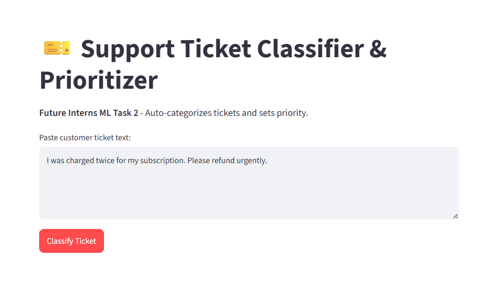
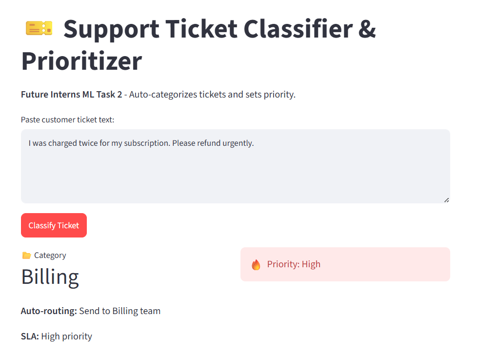
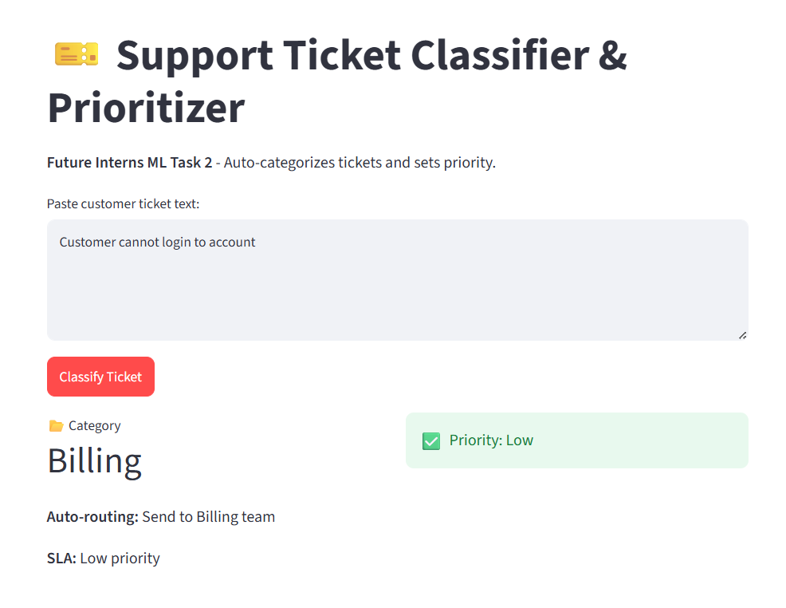

# 🎫 Support Ticket Classification & Prioritization

An AI-powered machine learning application that automatically classifies customer support tickets and predicts their priority, helping support teams respond more efficiently.


## 🚀 Features

- Automatic support ticket classification
- Priority prediction
- TF-IDF text vectorization
- Machine Learning model
- User-friendly interface
- Fast predictions

## 🛠️ Tech Stack

- Python
- Scikit-learn
- Pandas
- NumPy
- Streamlit / Flask
- Joblib

## 📂 Project Structure

```
FUTURE_ML_02/
│── app.py
│── requirements.txt
│── models/
│── dataset/
│── screenshots/
└── README.md
```

## Screenshots

### Home Page


### Prediction


### Output


## ⚙️ Installation

```bash
git clone https://github.com/kshofia2108-ux/FUTURE_ML_02.git
cd FUTURE_ML_02
pip install -r requirements.txt
python app.py
```

## 👩‍💻 Author

**Shofia K**

GitHub: https://github.com/kshofia2108-ux
